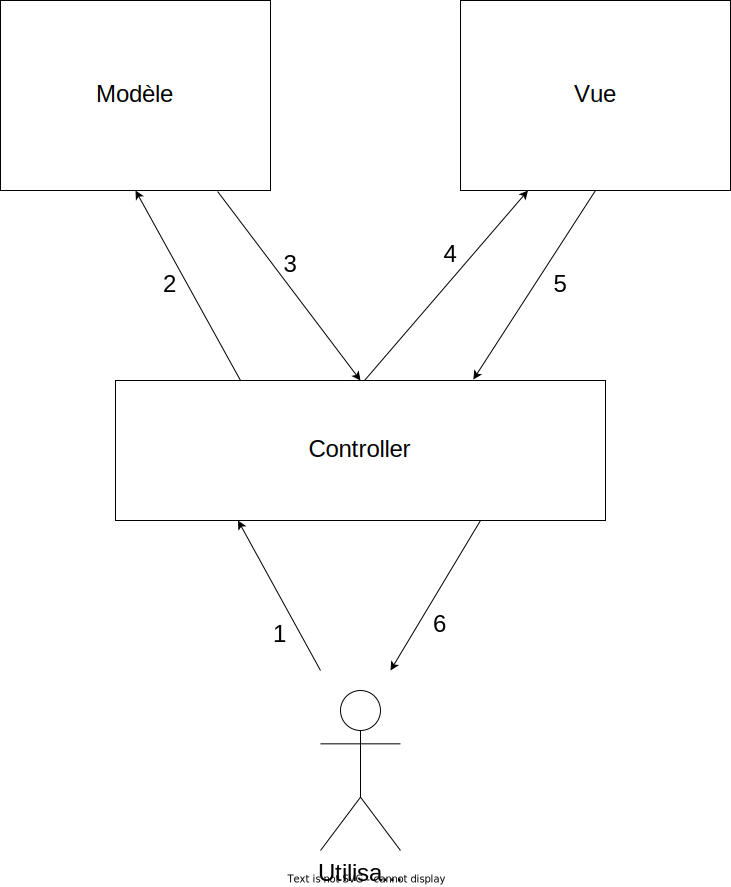

# Un blog à soi

Ceci est un projet de blog simple, pour expérimenter le framework Symfony dans le cadre d'[un cours en ligne, disponible sur YouTube](https://www.youtube.com/watch?v=lgAUOkaHbYo&list=PLOOzTDicdX41KJAY_odGjNwdtCAuZ6ynB). On y met en pratique les différents concepts appris tout au long des vidéos.

## Liste des vidéos et des slides

- [Introduction](https://www.youtube.com/watch?v=lgAUOkaHbYo) : [slides](https://slides.drakolab.fr/cours/Symfony/0-intro.html)
- [Démarrer un projet Symfony](https://www.youtube.com/watch?v=gqsFytKOX-k) : [slides](https://slides.drakolab.fr/cours/Symfony/1-demarrer-un-projet.html)
- [Routes et contrôleurs]() : [slides](https://slides.drakolab.fr/cours/Symfony/2-routes-et-controleurs.html)

## Notions abordées

### Modèle Vue Contrôleur (MVC)

Légende : 

1. L'utilisateur appelle une route (url spécifique à un site) et le contrôleur reçoit la requête
2. Le contrôleur fait (éventuellement) appel au modèle pour récupérer des données (en général, dans une base de données)
3. Le modèle est transmis au contrôleur
4. Le contrôleur transmet les données nécessaires à la vue, pour permettre la construction de celle-ci
5. Le contrôleur récupère la vue construite
6. Le contrôleur envoie une réponse à l'utilisateur, à partir de la vue