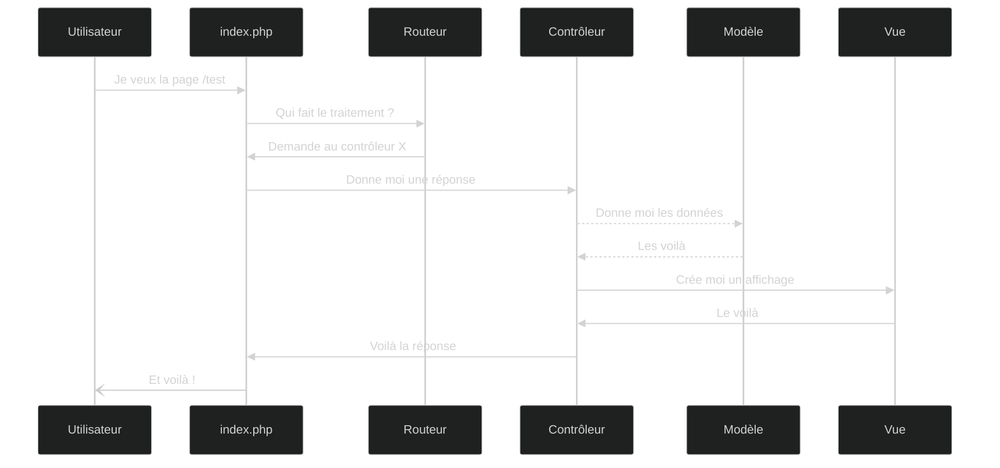

# Un blog à soi

Ceci est un projet de blog simple, pour expérimenter le framework Symfony dans le cadre d'[un cours en ligne, disponible sur YouTube](https://www.youtube.com/watch?v=lgAUOkaHbYo&list=PLOOzTDicdX41KJAY_odGjNwdtCAuZ6ynB). On y met en pratique les différents concepts appris tout au long des vidéos.

## Liste des vidéos et des slides

- [Introduction](https://www.youtube.com/watch?v=lgAUOkaHbYo) : [slides](https://slides.drakolab.fr/cours/Symfony/0-intro.html)
- [Démarrer un projet Symfony](https://www.youtube.com/watch?v=gqsFytKOX-k) : [slides](https://slides.drakolab.fr/cours/Symfony/1-demarrer-un-projet.html)
- [Routes et contrôleurs](https://www.youtube.com/watch?v=jwX-XmyjEzE) : [slides](https://slides.drakolab.fr/cours/Symfony/2-routes-et-controleurs.html)
- [Twig et templates](https://www.youtube.com/watch?v=jwX-XmyjEzE) : [slides](https://slides.drakolab.fr/cours/Symfony/3-twig.html)

## Notions abordées

### Modèle Vue Contrôleur (MVC)

Le traitement d'une requête avec Symfony se fait en 10 étapes (pour résumer ;) ) :
1. L'utilisateur demande une page `/test`. C'est le FrontController qui la reçoit
2. Le FrontController demande le contrôleur correspondant à `/test` au routeur
3. Le routeur donne l'objet et la méthode à appeler
4. Le FrontController appelle le contrôleur et sa méthode
5. Le contrôleur appelle le modèle (BdD) pour récupérer les données si besoin
6. Le modèle renvoie les données demandées
7. Le contrôleur traite ses données (fait ses calculs) et les envoie à la vue pour construire un affichage
8. Le moteur de template renvoie la vue construite
9. Le contrôleur construit une réponse et l'envoie au FrontController
10. Le FrontController renvoie la réponse à l'utilisateur