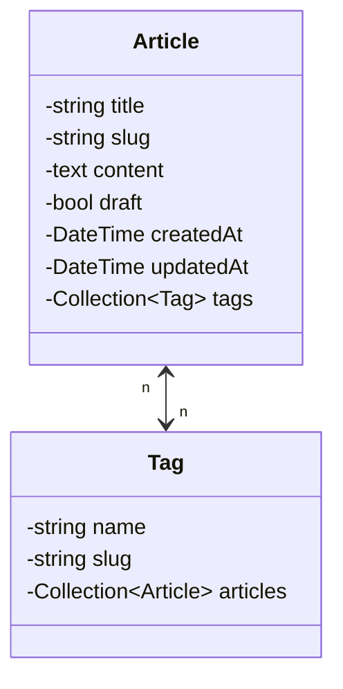

# Doctrine

## MCD

```mermaid
classDiagram
    Article "n" <--> "n" Tag

    class Article {
        -string title
        -string slug
        -text content
        -bool draft
        -DateTime createdAt
        -DateTime updatedAt
        -Collection~Tag~ tags
    }
    class Tag {
        -string name
        -string slug
        -Collection~Article~ articles
    }
```